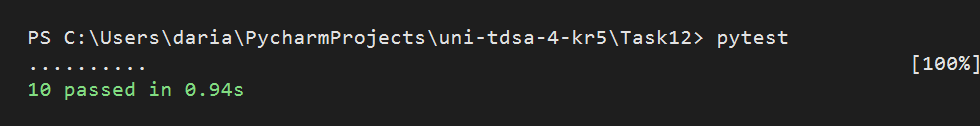
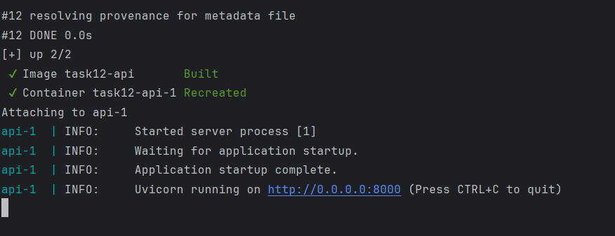
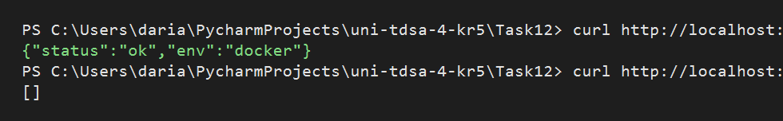

# Задание 1-2

## Локальный запуск

```powershell
python -m venv .venv
.\.venv\Scripts\activate
pip install -r requirements.txt
uvicorn app.main:app --reload
```

## Запуск тестов

```powershell
pytest
```



## Запуск через Docker Compose

```powershell
docker compose up --build
```



## Проверка API

```powershell
curl http://localhost:8000/tasks -H "X-User-Id: 10"
```

Ожидаемый ответ:

```json
[]
```

```powershell
curl http://localhost:8000/health
```

Ожидаемый ответ:

```json
{
  "status": "ok",
  "env": "docker"
}
```


