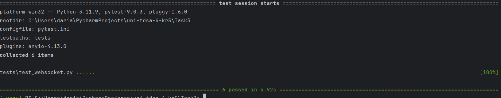

# Задание 3

## Установка

```powershell
python -m venv .venv
.\.venv\Scripts\activate
pip install -r requirements.txt
```

## Запуск приложения

```powershell
uvicorn app.main:app --reload
```

## Запуск тестов

```powershell
pytest
```



## Маршруты

WebSocket:

```text
/ws/rooms/{room_id}?username=alice
```

Просмотр активных комнат:

```text
GET /rooms/{room_id}/users
```

Пример ответа:

```json
{
  "room_id": "python",
  "users": ["alice", "bob"]
}
```

Пример сообщения:

```json
{
  "type": "message",
  "text": "Hello"
}
```
