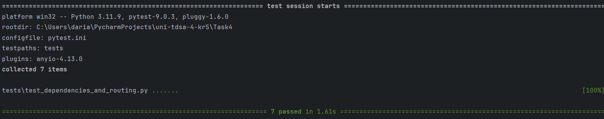

# Задание 4

## Запуск

```powershell
pip install -r requirements.txt
uvicorn app.main:app --reload
```

## Тесты

```powershell
pytest
```



## Заголовки

```text
X-User-Id: 10
X-User-Role: user
```

Для админа:

```text
X-User-Id: 1
X-User-Role: admin
```

## Эндпоинты

tasks:

```text
POST /tasks
GET /tasks
GET /tasks/{task_id}
PATCH /tasks/{task_id}/status
DELETE /tasks/{task_id}
```

users:

```text
GET /users/me
GET /users/{user_id}
```

admin:

```text
GET /admin/stats
DELETE /admin/tasks/{task_id}
```

## Зависимости

```text
get_current_user - читает X-User-Id и X-User-Role, возвращает {"id": 10, "role": "user"}
require_admin - пускает только пользователя с ролью admin, иначе 403
get_storage - возвращает хранилище задач
```

`/tasks` использует `get_current_user`.

`/admin` использует `require_admin`.

`/admin/stats` возвращает статистику по всем задачам.

Админ может удалить любую задачу через `/admin/tasks/{task_id}`.
